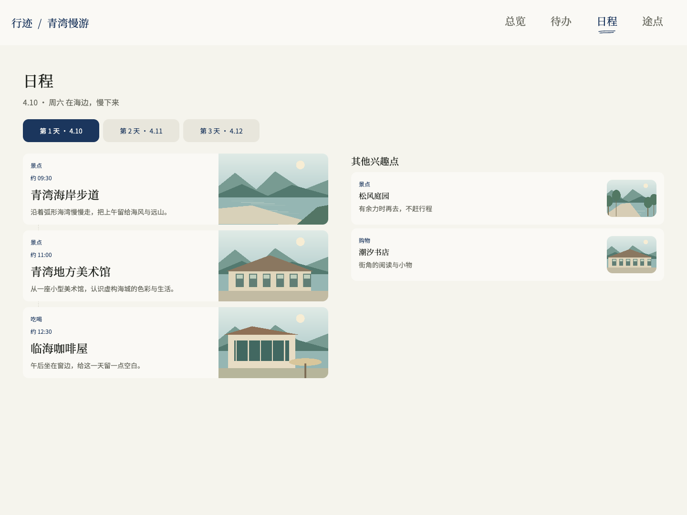
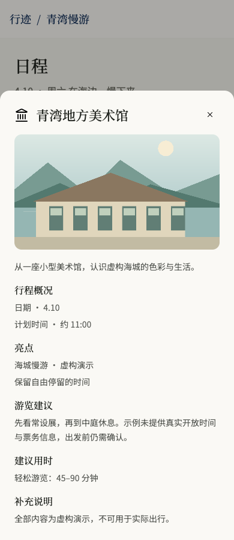

# 旅册 · Travel Handbook Builder

**把散落的旅行资料，整理成一本能随时翻看、继续修改的私人旅行手册。**

给支持 Skill 的 AI 助手一份行程、一段笔记，或几轮对话。它可以借助旅册整理每天的安排、收藏的地点、住宿与出发前待办，并在浏览器里呈现。你决定去哪、怎么走；旅册帮助你把决定和仍待确认的事记清楚。

[下载最新版本](https://github.com/kyangc/travel-handbook-builder-skill/releases/latest) · [开始使用](#开始使用) · [更新记录](CHANGELOG.md)

*页面截图来自 0.3.2 实际运行的旅册；本版详情尺寸与交互已有调整。这里的「青湾慢游」是虚构演示，风景为自制示意插图，不代表真实地点或可执行行程。*

## 一份攻略，从出发前用到旅途中

- **把一天看清楚。** 按天查看已安排的活动与交通，点开地点了解介绍和补充说明。
- **收藏和安排各有位置。** 想去的地方留在“其他兴趣点”，不会因为被收藏就变成当天必去。
- **重要信息放在一起。** 住宿、往返交通和准备清单集中查看，不必在多份聊天记录里来回翻找。
- **计划变了，可以接着改。** 保存本地旅行工作区，下次让助手继续补充或更正，保留已经确认的内容。
- **没确定的，就保持待确认。** 推荐、安排、预订与付款分别记录；缺少的信息不会悄悄变成“已完成”。

## 从每天的节奏，看到一个地点的细节

桌面日程把已安排的活动和其他兴趣点放在同一页。同一天已在日程地点卡出现的地点，不再重复占据兴趣点列表。

手机也可以阅读这份手册，点开卡片查看介绍、游览建议和待确认事项。0.3.3 改善了详情开合、地图加载恢复和待办保存失败提示，并支持系统的“减少动态效果”偏好。

## 开始使用

旅册是提供给 AI 助手的 **Skill**，需要配合 Codex、Kimi CLI 或其他支持本地 Skill 的工具使用。运行环境为 Python 3.12+ 与 POSIX shell（如 macOS、Linux）；首次初始化需要安装运行依赖。

1. 从 [Releases](https://github.com/kyangc/travel-handbook-builder-skill/releases/latest) 下载 ZIP 并解压，保留完整的 `travel-handbook-builder-skill` 文件夹。
2. 按 [安装指南](travel-handbook-builder-skill/README.md#requirements-and-isolated-setup) 完成校验、初始化，并让你的 AI 助手加载该 Skill。
3. 把旅行资料保存在你自己的本地目录，在新对话里让助手开始整理。

可以这样说：

> 请用 travel-handbook-builder-skill，把这份行程笔记整理成私人旅行手册，并打开本地预览。保留我已经确定的安排，推荐地点单独列出；没有确认的时间、预订和费用不要补猜。

之后继续补充：

> 请继续修改这份手册：把第二天下午留空，把美术馆先放进其他兴趣点。其他已经确定的内容保持不变，告诉我还有哪些信息待确认。

旅行资料与工作区放在 Skill 安装目录之外，方便续作与备份。具体加载方式、恢复与命令说明见 [使用指南](travel-handbook-builder-skill/README.md)。

## 适合什么，不代替什么

适合把已有资料逐步整理为清楚、可继续编辑的旅行手册，也适合边讨论边补充尚未确定的行程。浏览器预览在本机运行；分享链接、跨设备访问与公开托管不属于默认交付。

它不会替你作出最终旅行选择、订票、付款，也不保证营业时间、价格、交通接驳或外部图片始终有效。出行前仍需核实关键事实；AI 助手整理出的结果也需要你审阅。选择云端 AI 助手时，资料如何发送和保存仍取决于该工具，不能把“本地手册”理解成所有处理都离线。

本版截图展示的是合成示例与已实现页面，不是对任意真实旅行、所有设备或助手表现的保证。版本变化和具体验证边界见 [CHANGELOG](CHANGELOG.md)。

## 进一步了解

[完整安装与使用说明](travel-handbook-builder-skill/README.md) · [给 AI 助手的入口](travel-handbook-builder-skill/SKILL.md) · [贡献说明](CONTRIBUTING.md) · [维护与发布](RELEASING.md)

开源许可：[MIT](LICENSE)。第三方组件与归属：[THIRD_PARTY_NOTICES](THIRD_PARTY_NOTICES.md)。
