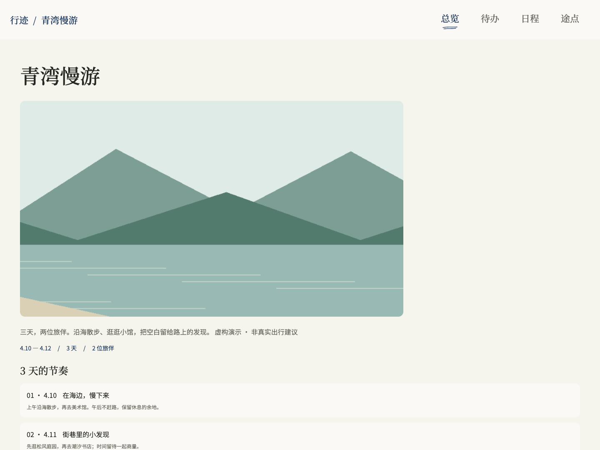
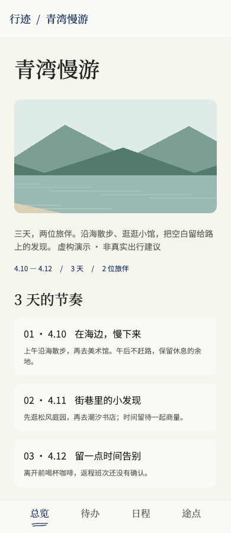
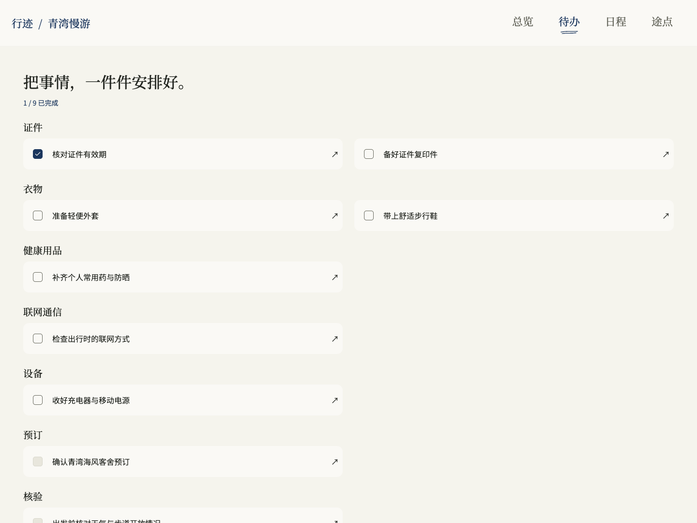
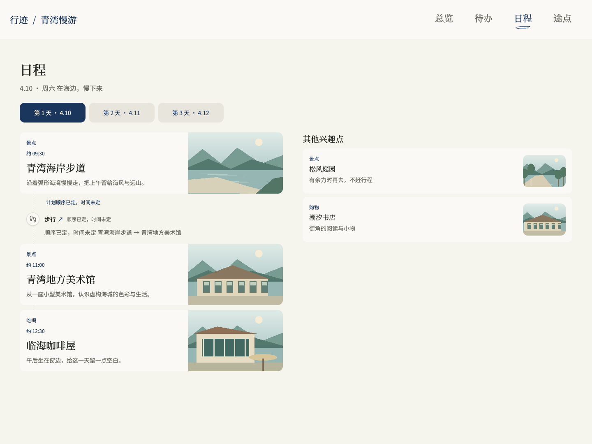
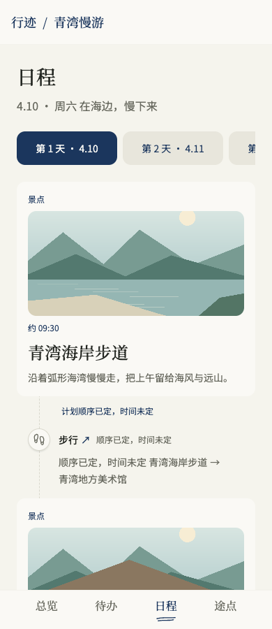
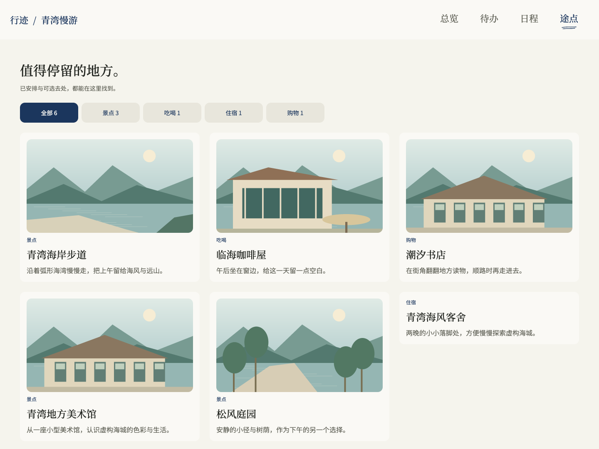
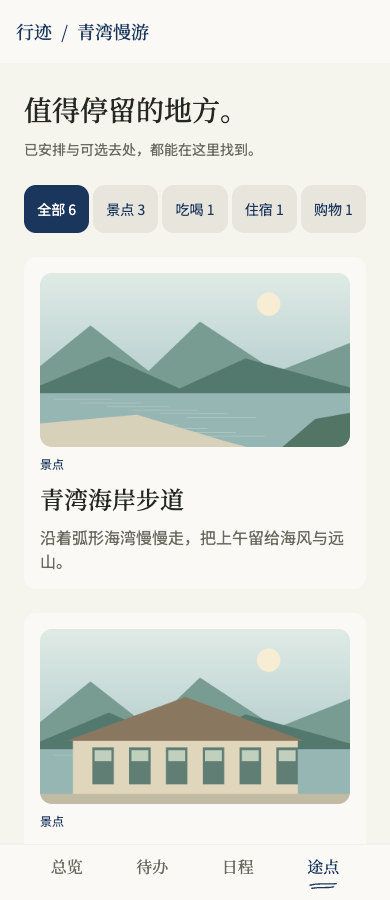

# 行迹产品导览

[返回首页](../README.md) · [开始使用](../README.md#开始使用)

从一段旅行笔记开始，让支持本地 Skill 的 AI 助手整理成手册；计划变化时，继续修改同一个工作区。网页把这份计划分成四个标签页，方便从全局安排走到当天和具体地点。

下方八张截图来自正式发布的 **0.3.6** 前端，在真实 Chrome 中操作并截取：电脑 1440×1080，手机尺寸 390×900。八张均展示当前视口的首屏。同一份虚构「青湾慢游」包含三天安排、六个地点、住宿、步行衔接和九项准备事项。风景是自制示意插图，不是实景照片，也不是实际出行建议；点击图片可查看原尺寸。

[总览](#总览) · [待办](#待办) · [日程](#日程) · [途点](#途点)

## 总览

先看三天的节奏，再查住宿和出发前的准备。点击某一天就能进入对应日程，已有往返交通也可集中呈现。电脑便于看全局，手机布局把内容按阅读顺序纵向排列。

| 电脑 | 手机 |
| --- | --- |
|  |  |

## 待办

证件、衣物、健康用品、联网和预订等准备事项分组查看。截图里通过真实勾选操作完成了一项；关联住宿等安排的待办可打开详情，核对要做什么。

网页勾选保存在当前浏览器，用于自己的准备进度；它不等于已订票、已办理，也不自动改写助手工作区中的完成事实。

| 电脑 | 手机 |
| --- | --- |
|  |  |

## 日程

按日期查活动与交通衔接，点开地点阅读介绍和游览建议。“其他兴趣点”保留还没排入当天的去处，避免把收藏误当成必须完成的安排。时间缺失时保留未知，估算的时间也明确标注。

| 电脑 | 手机 |
| --- | --- |
|  |  |

## 途点

已安排和可选地点放在同一目录，按景点、吃喝、购物和住宿等类别筛选。点击卡片查看地点介绍、停留建议和待核实的信息，计划没有采用的地方仍可保留。

| 电脑 | 手机 |
| --- | --- |
|  |  |

另见[手机地点详情](screenshots/mobile-detail.png)，以及[截图来源与使用说明](screenshots/README.md)。

## 从资料到可以继续修订的手册

你决定去哪、怎么走。助手通过对话整理你提供的资料，并可补充相关公开事实；手册保留来源与待确认项。活动、住宿、交通和准备事项能关联起来，修改后还可继续读回检查，避免靠复制多份文档维护计划。

电脑和手机截图展示同一份手册的响应式布局。公共 Skill 的浏览器预览默认在本机运行，不附带公开托管、账号登录、跨设备同步或离线保存站点服务；手机访问需另行安排，参见[使用边界](../README.md#使用边界)。

地图可用自行配置的 Google Maps，Skill 不附带 key；无 key 或服务不可用时只显示标注清楚的地点示意，不提供真实离线底图。出发前仍需核实营业、价格、预订和接驳等关键事实。
